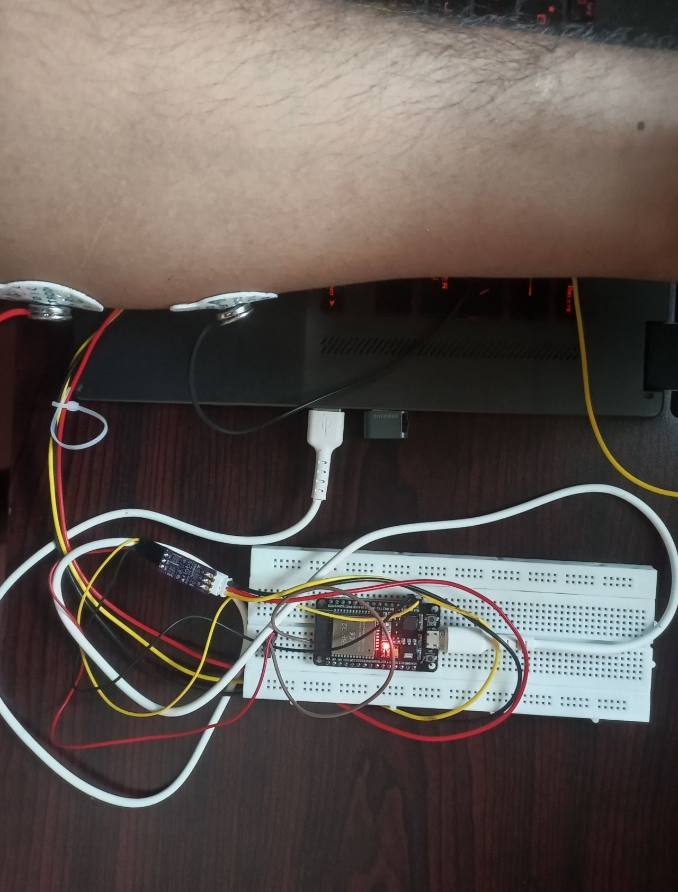

# 🧠 NeuroPulse v2.0 AI-Clinic

NeuroPulse v2 is a **Medical-Grade EMG Analytics System** designed for real-time tremor staging and Parkinsonian diagnosis. It integrates high-speed hardware acquisition (ESP32) with advanced AI classification and a premium clinical dashboard.


*Fig 1: Clinical hardware setup showing ESP32 acquisition and EMG electrode placement.*

---

## 🚀 Key Features

*   **Clinical Tremor Staging**: Proprietary AI engine that classifies tremors into *Normal*, *Mild*, *Moderate*, or *Severe* with 90%+ confidence.
*   **Medical-Grade DSP**: 4th-order Butterworth filters and 50Hz Notch filters for ultra-clean signal processing.
*   **Rolling Window Analytics**: 1-second rolling analysis window to capture precise frequency oscillations (3-12 Hz).
*   **Real-time Dashboard**: Optimized for clinical use with predictive diagnosis, signal decomposition, and historical logging.
*   **Universal Connector**: High-speed Serial-to-WebSocket bridge for seamless hardware-to-cloud data flow.

---

## 🛠️ Technology Stack

*   **Hardware**: ESP32 + EMG Analog Sensor (Sampling @ 200Hz).
*   **Backend**: Python FastAPI + Scikit-Learn (AI Engine) + Scipy (DSP).
*   **Frontend**: Next.js + Tailwind CSS + Framer Motion (Real-time Visuals).
*   **Database**: PostgreSQL (Clinical Storage) + Local JSON fallback.
*   **CLI**: Medical Monitor Utility for raw signal verification.

---

## 🏃 Quick Start

### 1. Hardware Initialization
Ensure your ESP32 is flashed with the clinical firmware in `hardware/src/main.cpp`.

### 2. Launch Stack
Run the universal launcher to start the Backend, Frontend, and Serial Bridge:
```bash
./scripts/run_all.sh
```

### 3. Verify Signal
Use the CLI monitor to check the board connection:
```bash
./backend/venv/bin/python ./scripts/monitor.py /dev/ttyUSB0
```

---

## 📂 Project Structure

*   `/backend`: Clinical AI logic, DSP engine, and FastAPI server.
*   `/frontend`: Dashboard UI and WebSocket integration.
*   `/hardware`: ESP32 firmware (PlatformIO).
*   `/scripts`: Deployment and automation utilities.

---

## ⚖️ Disclaimer
*This system is intended for research and educational purposes. Accuracy should be verified by professional clinical practitioners.*
